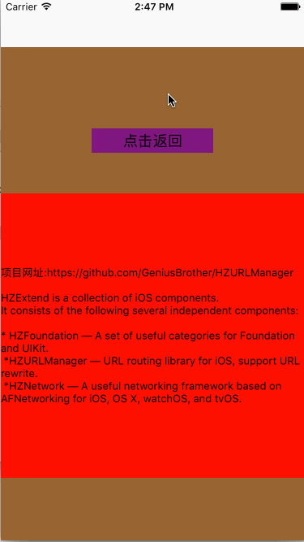

HZURLManager
==============

[](https://raw.githubusercontent.com/GeniusBrother/HZURLManager/master/LICENSE)&nbsp;
[](http://cocoapods.org/pods/HZURLManager)&nbsp;
[](http://cocoadocs.org/docsets/HZURLManager)&nbsp;
[](https://www.apple.com/nl/ios/)&nbsp;

URL routing library for iOS, support URL rewrite.<br/>
(It's a component of [HZExtend](https://github.com/ibireme/HZExtend))

Contact
==============
#### QQ Group:32272635
#### Email:zuohong_xie@163.com

Preview
==============


Installation
==============
### CocoaPods

1. Add `pod 'HZURLManager` to your Podfile.
2. Run `pod install` or `pod update`.
3. Import \<HZURLManager/HZURLManager.h\>.

Documentation
==============
Full API documentation is available on [CocoaDocs](http://cocoadocs.org/docsets/HZURLManager/).<br/>

Requirements
==============
This library requires `iOS 8.0+` and `Xcode 8.0+`.

License
==============
HZURLManager is provided under the MIT license. See LICENSE file for details.

Usage
==============
### URL Config
```objective-c
- (BOOL)application:(UIApplication *)application didFinishLaunchingWithOptions:(NSDictionary *)launchOptions {
    
     //Loads URL-Controller & URL-Method Config.
    [[HZURLManagerConfig sharedConfig] loadURLCtrlConfig:[[NSBundle mainBundle] pathForResource:@"URL-Controller-Config" ofType:@"plist"] urlMethodConfig:[[NSBundle mainBundle] pathForResource:@"URL-Method-Config" ofType:@"plist"]];
    
    //Adds URL Rewrite rule. You may be get the rule from remote.
    /**
      The variable can be used in the target and starts with $, For example, $ 1 ... $ n represents the value of the corresponding tuple in the regular expression, $ query represents the query string part in the URL. 
 
 For example, when the @{@"match":@"(?:https://)?www.hz.com/articles/(\\d)\\?(.*)",@"target":@"hz://page.hz/article?$query&id=$1"} rule is applied, the rewrite engine rewrites the source URL as hz://page.hz/article?title=cool&id=3 when we redirect to https://ww.hz.com/articles/3?title=cool , Finally we'll jump to hz://page.hz/article?title=cool&id=3.
     */
    [[HZURLManagerConfig sharedConfig] addRewriteRules:@[@{@"match":@"(?:https://)?www.hz.com/articles/(\\d)\\?(.*)",@"target":@"hz://page.hz/article?$query&id=$1"}]];
    
    //Configs the default name of controller for Http(s) URL.
    [HZURLManagerConfig sharedConfig].classOfWebViewCtrl = @"WebViewController";                                        
}    
```
### Redirect
```objective-c
//Present
[URL_MANAGERN redirectToURL:@"hz://page.hz/article?title=present" animated:YES parmas:nil options:@{HZRedirectPresentMode:@(YES)} completion:nil];

//Push
//The following URL will be converted to hz://page.hz/article by rewriting.
[URL_MANAGERN redirectToURL:@"https://www.hz.com/articles/3?title=push" animated:YES];

```

### Executes Method
```objective-c
@interface ShowAlertURLHandler ()<HZURLHandler>
@end
@implementation ShowAlertURLHandler
/**
 hz://urlmanger.kit/doAlert
 
 @param title
 @param message
 */
- (id)handleURL:(NSURL *)url withParams:(id)params
{
    NSDictionary *queryParam = url.queryDic;
    
    NSString *title = [queryParam objectForKey:@"title"];
    NSString *message = [queryParam objectForKey:@"message"];
    
    UIAlertController *alerController = [UIAlertController alertControllerWithTitle:title message:message preferredStyle:UIAlertControllerStyleAlert];
    UIAlertAction *confirmAtion = [UIAlertAction actionWithTitle:@"Confirm" style:UIAlertActionStyleDefault handler:nil];
    [alerController addAction:confirmAtion];
    UIAlertAction *cancleAction = [UIAlertAction actionWithTitle:@"Cancle" style:UIAlertActionStyleCancel handler:nil];
    [alerController addAction:cancleAction];
    [[HZURLNavigation currentViewController] presentViewController:alerController animated:YES completion:nil];

    return nil;
}

@end

//show the alert
[URL_MANAGERN handleURL:@"hz://urlmanger.kit/doAlert?title=alert&message=URL-showAlert" withParams:nil];
```

### Navigation
```objective-c
//Creates Controller
UIViewController *controller = [UIViewController viewControllerForURL:[NSURL URLWithString:@"hz://page.hz/article"]];

//Gets current Controller
UIViewController *currentViewCtrl = [HZURLNavigation currentViewController];

//Gets current Navigation Controller
UIViewController *currentNavViewCtrl = [HZURLNavigation currentNavigationViewController];

//Dismiss(Pop or dissmiss) View Controller
[HZURLNavigation dismissCurrentAnimated:YES];

```

### Param
```objective-c
@interface UIViewController (HZURLManager)

/**
 The URL corresponding to the Controller
 */
@property(nonatomic, strong, readonly) NSString *originURL;

/**
 Consists of a query string and additional parameters passed by user.
 */
@property(nonatomic, strong, readonly) NSDictionary *params;

@end
```

